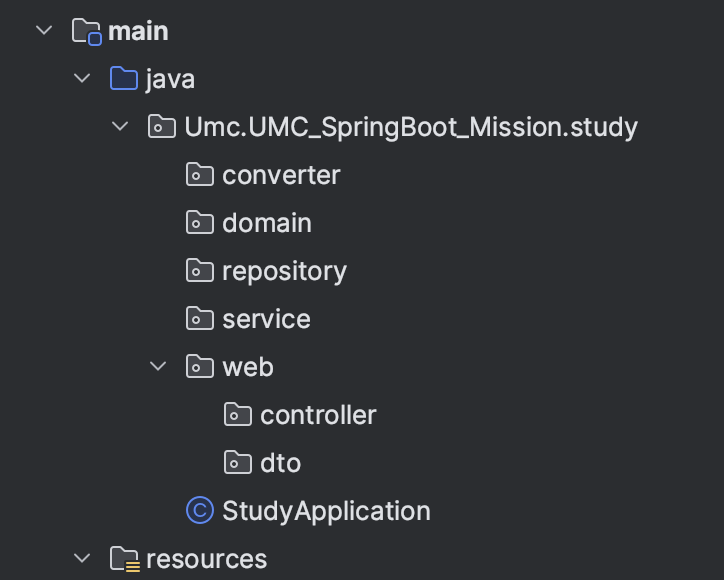
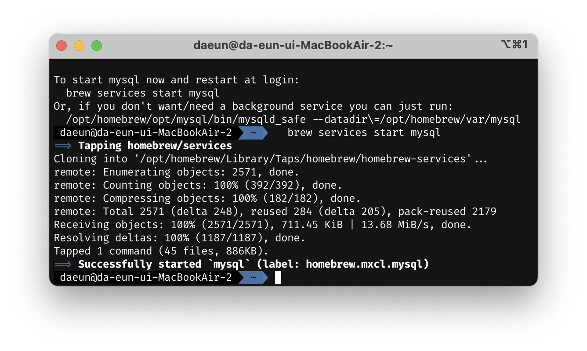
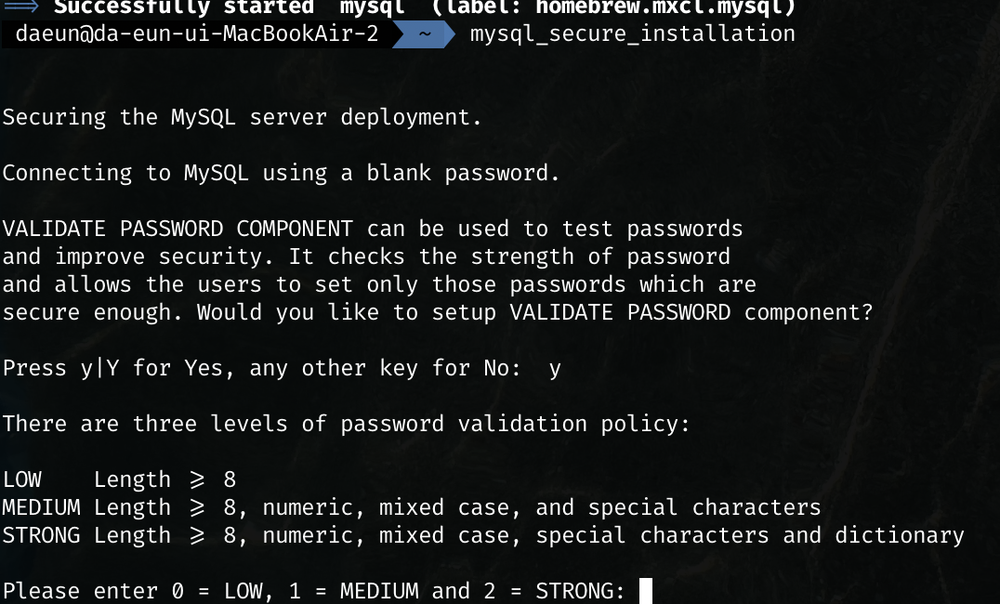
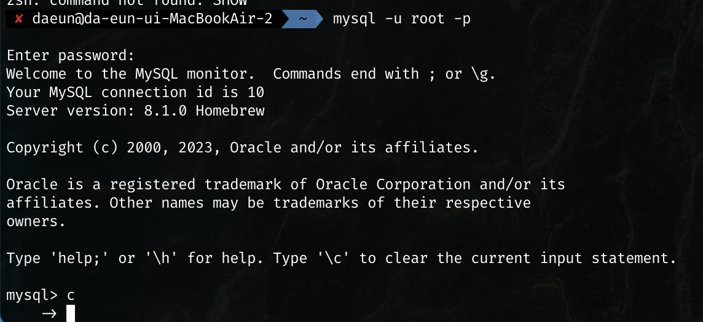
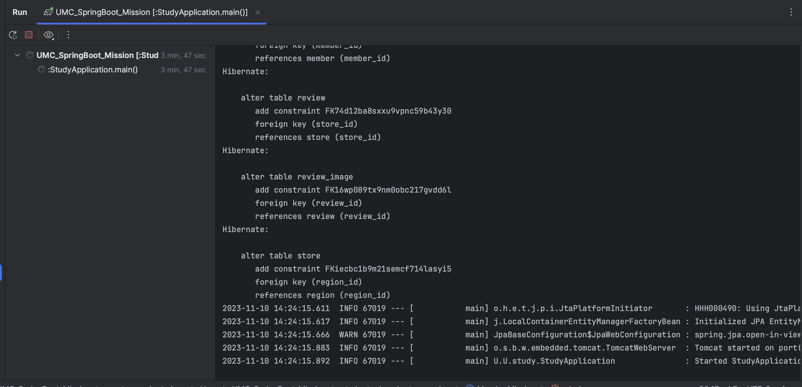
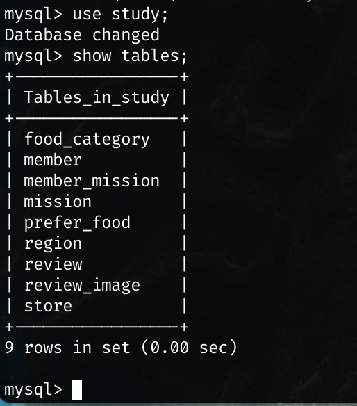

# UMC_SpringBoot_Study


<br>

# 📄 WorkBook

### ✅ 프로젝트 생성
- `UMC_SpringBoot_Mission` 이라는 SpringBoot project 생성
- 디렉토리 컨벤션  <br>

<br>

### ✅ DB 준비
RDS DB와 로컬 mysql 중 편한 DB를 사용하면 되는데, 저는 mysql을 사용해서 실습을 진행하도록 하겠습니다 <br>
- mysql 설치 <br>
    `brew install mysql` 을 통해 mysql을 설치해줍니다 <br>
- mysql 시작 <br>
    `brew services start mysql` 명령어를 통해 mysql 서비스를 시작할 수 있습니다 <br>
     <br>
- mysql security 설정 <br>
    초기 설정의 경우, 사용자 비밀번호가 설정되어있지 않아 mysql 서비스는 root 비밀번호 없이 실행됩니다 <br>
    `mysql_secure_installation` 명령어를 통해 보안을 위한 root 비밀번호를 설정할 수 있습니다 <br><br>
         <br><br> 
- mysql 로그인 <br>
    비밀번호 설정을 마쳤다면, `mysql -u root -p` 명령어를 사용해 mysql에 root 계정으로 로그인할 수 있습니다 <br><br>
     <br><br>
- mysql db 준비 <br>
    mysql 설치를 끝냈다면, **`study`라는 이름으로 db를 만들어줍니다** <br> <br>
        
    <br><br>
    build.gradle에 `runtimeOnly 'com.mysql:mysql-connector-j'` 를 넣어 의존성 관계를 추가해주고, <br>
    db 연결을 위해 프로젝트에 `application.yml`을 추가해줍니다 <br><br>
    ```
    spring:
  datasource: 
    url: jdbc:mysql://localhost:3306/study
    username: 님들의 유저 이름
    password: 님들의 비밀번호
    driver-class-name: com.mysql.cj.jdbc.Driver
  sql:
    init:
      mode: never
  jpa:
    properties:
      hibernate:
        dialect: org.hibernate.dialect.MySQL8Dialect
        show_sql: true
        format_sql: true
        use_sql_comments: true
        hbm2ddl:
          auto: update
        default_batch_fetch_size: 1000
    ```
    
    <br>
    
# ✅ domain Entity Mapping
🔎 erdcloud에 있는 테이블들을 직접 코드로 작성하고 테이블 간의 연관관계를 설정해보겠습니다 <br>
`converter`, `domain`, `service`, `repository`, `web` pacakage를 만든 후 테이블 관련 파일들은 모두 domain 패키지에 작성하겠습니다 <br>

### ✅ Enum 분류
name, email, number처럼 사용자마다 각각의 값이 존재하고, 개발자의 입장에서 해당 변수에 <br>
어떤 값이 들어갈지 모르는 변수들이 있습니다 <br>
그러나 **성별, 미션 성공 유무, 로그인 타입** 등 값의 종류가 한정되어있는 변수들이 가끔 존재합니다 <br>
이러한 변수들은 enum 타입으로 파일을 따로 만들어 주는게 더 편리하다고 합니다! <br>
저는 3가지의 enum 파일을 만들어 enums 라는 패키지에 따로 저장해주었습니다 <br>
- ```java
public enum MissionStatus {
    CHALLENGING, COMPLETE
}
```
- ```java
public enum LoginType {
    KAKAO, APPLE, NAVER, GOOGLE
}
```
- ```java
public enum Gender {
    MALE, FEMALE
}
```

<br>

### ✅ Member class  


### ✅ Application file
이 프로젝트를 실행할 Application file을 `StudyApplication`으로 지정해 새로 파일을 만들어주고, <br>
- `@SpringBootApplication` <br>
- `@EnableJpaAuditing` <br>
annotation을 추가해주었습니다 <br>


<br><hr><br>
    
    
### ✅ create Tables
- application 파일을 실행해서 테이블을 `create`해보겠습니다 <br>
db를 처음 만들어 empty set 상태이기에, yml의 ddl auto에 `create` 옵션을 걸어 실행하면 처음에는 테이블을 찾을 수 없다는 오류가 뜹니다 <br>
실행을 다시 눌러주면 정상적으로 테이블이 생성됩니다 ! <br>
⚠️ `create`옵션은 **기존 테이블을 없애고 새로 만들기 때문**에 실습 이후로 `update`로 변경해두었습니다 <br>

         <br><br><br>
        
- `use study;`문을 통해 study라는 db를 사용함을 명시한 후 <br>
`show tables;`를 통해 db에 생성된 테이블을 확인할 수 있습니다 <br><br>
사진과 같이, db에 테이블이 무사히 생성되었습니다 😇👍 <br><br>
 <br>

<br><br>

### 🔎 mysql 문법 알아보기
이번 실습을 진행하며 Local mysql을 처음 사용해보았는데요 <br>
이번에 사용한 문법들에 대해 간단히 정리해보겠습니다‼️ <br><br>
- 로그인 <br>
`mysql -u root -p` <br>
- db 생성 <br>
`create database DB이름` <br>
- db 삭제 <br>
`drop database DB이름` <br>
- db 사용 <br>
`use DB이름` <br>
- db에 저장된 테이블 모두 보기 <br>
`show tables` <br>
- db에 저장된 테이블 삭제 <br>
`drop table TABLE이름` <br>
- mysql 종료 <br>
`quit`<br>


    
    


    

