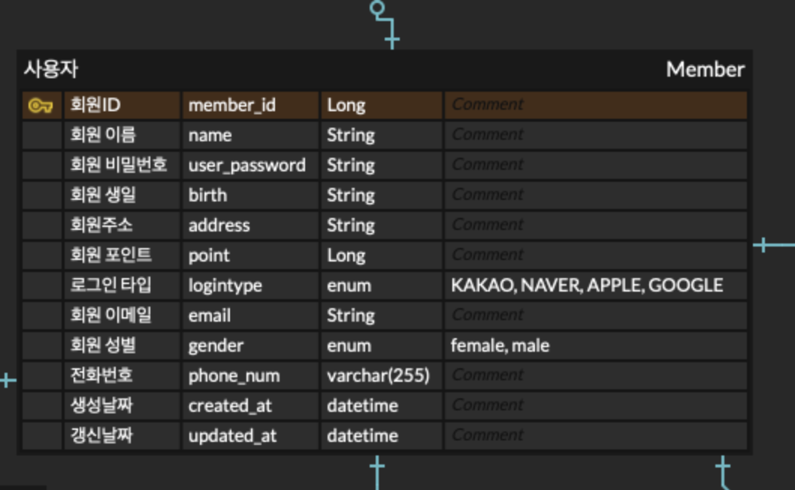

# UMC_SpringBoot_Study


<br>

# 📄 WorkBook

### ✅ 프로젝트 생성
- `UMC_SpringBoot_Mission` 이라는 SpringBoot project 생성
- 디렉토리 컨벤션  <br>

<br>

### ✅ DB 준비
RDS DB와 로컬 mysql 중 편한 DB를 사용하면 되는데, 저는 mysql을 사용해서 실습을 진행하도록 하겠습니다 <br>
- mysql 설치 <br>
    `brew install mysql` 을 통해 mysql을 설치해줍니다 <br>
- mysql 시작 <br>
    `brew services start mysql` 명령어를 통해 mysql 서비스를 시작할 수 있습니다 <br>
     <br>
- mysql security 설정 <br>
    초기 설정의 경우, 사용자 비밀번호가 설정되어있지 않아 mysql 서비스는 root 비밀번호 없이 실행됩니다 <br>
    `mysql_secure_installation` 명령어를 통해 보안을 위한 root 비밀번호를 설정할 수 있습니다 <br><br>
         <br><br> 
- mysql 로그인 <br>
    비밀번호 설정을 마쳤다면, `mysql -u root -p` 명령어를 사용해 mysql에 root 계정으로 로그인할 수 있습니다 <br><br>
     <br><br>
- mysql db 준비 <br>
    mysql 설치를 끝냈다면, **`study`라는 이름으로 db를 만들어줍니다** <br> <br>
        
    <br><br>
    build.gradle에 `runtimeOnly 'com.mysql:mysql-connector-j'` 를 넣어 의존성 관계를 추가해주고, <br>
    db 연결을 위해 프로젝트에 `application.yml`을 추가해줍니다 <br><br>
    ```
    spring:
  datasource: 
    url: jdbc:mysql://localhost:3306/study
    username: 님들의 유저 이름
    password: 님들의 비밀번호
    driver-class-name: com.mysql.cj.jdbc.Driver
  sql:
    init:
      mode: never
  jpa:
    properties:
      hibernate:
        dialect: org.hibernate.dialect.MySQL8Dialect
        show_sql: true
        format_sql: true
        use_sql_comments: true
        hbm2ddl:
          auto: update
        default_batch_fetch_size: 1000
    ```
    
    <br>
    
# ✅ domain Entity Mapping
🔎 erdcloud에 있는 테이블들을 직접 코드로 작성하고 테이블 간의 연관관계를 설정해보겠습니다 <br>
`converter`, `domain`, `service`, `repository`, `web` pacakage를 만든 후 테이블 관련 파일들은 모두 domain 패키지에 작성하겠습니다 <br>

### ✅ Enum 분류
name, email, number처럼 사용자마다 각각의 값이 존재하고, 개발자의 입장에서 해당 변수에 <br>
어떤 값이 들어갈지 모르는 변수들이 있습니다 <br>
그러나 **성별, 미션 성공 유무, 로그인 타입** 등 값의 종류가 한정되어있는 변수들이 가끔 존재합니다 <br>
이러한 변수들은 enum 타입으로 파일을 따로 만들어 주는게 더 편리하다고 합니다! <br>
저는 3가지의 enum 파일을 만들어 enums 라는 패키지에 따로 저장해주었습니다 <br>
```java
public enum MissionStatus {
    CHALLENGING, COMPLETE
}
```
```java
public enum LoginType {
    KAKAO, APPLE, NAVER, GOOGLE
}
```
```java
public enum Gender {
    MALE, FEMALE
}
```

<br>

### ✅ Base Entity
모든 테이블에는 `created_at`, `updated_at`필드가 존재합니다 <br>
이 두가지 필드를 모든 테이블에 각각 추가하기에는 너무 번거로우므로, `Base Entity`를 만들어 <br>
각 엔티티가 이 파일을 상속받도록 설정해 `created_at`, `updated_at` 필드를 손쉽게 추가할 수 있습니다‼️ <br>
`common`패키지를 만들어 그 내부에 Base Entity를 만들어 줍니다 <br>
```java
@MappedSuperclass
@EntityListeners(AuditingEntityListener.class)
@Getter
public abstract class BaseEntity {

    @CreatedDate
    private LocalDateTime createdAt;

    @LastModifiedDate
    private LocalDateTime updatedAt;
}
```

<br>

### ✅ Member Entity  
member 테이블에 해당하는 엔티티를 만들어보겠습니다 <br>

table의 필드들을 `Member` 클래스에 작성해주고, 위에서 만든 Base Entity를 상속받아줍니다 <br>
```java
@Entity //Entity임을 명시
@Getter
@Builder //Builder pattern을 사용하기 위함
@NoArgsConstructor(access = AccessLevel.PROTECTED)
@AllArgsConstructor
public class Member extends BaseEntity {
    @Id @GeneratedValue(strategy = GenerationType.IDENTITY)
    private Long memberId;
    private String name;
    private String userPassword;
    private String birth;
    private String address;
    private Long point;

    @Enumerated(EnumType.STRING) //enum을 Entity에 적용
    private LoginType loginType;

    @Column(nullable = false, length = 50)
    private String email;

    @Enumerated(EnumType.STRING)
    @Column(columnDefinition = "VARCHAR(10)")
    private Gender gender;
    private String phoneNum;
}
```
- id <br>
각 테이블의 pk값을 클래스에 Long type id변수로 만들고 `@Id`를 통해 이 변수가 id임을 명시해줍니다 <br>
- 테이블의 필드에 맞게 다른 변수들을 생성해주고, 알맞은 타입도 지정해줍니다 <br>
- enum 지정 <br>
loginType, gender 변수는 위에서 만든 enum을 사용해 타입을 지정해주었습니다 <br>
`@Enumerated(EnumType.STRING)`을 통해 enum 사용을 명시해주었습니다 <br>
⚠️ EnumType을 ORDINAL로 하면 안된다고 합니다 ! (enum에서 순서를 보장하는데 기본값인 ORDINAL을 사용하면 순서가 꼬이는 일이 생길 수 있어 STRING 사용 강력 권고) <br>

### ✅ Entity 생성
다른 테이블들도 위와 같이 만들어주겠습니다 아직 연관관계 설정을 하지 않아 기본적인 필드들만 추가해줬습니다<br>

### ✅ 단방향 연관관계 매핑
🔎 **연관관계 주인** : 테이블에서 외래키를 가지는 테이블 <br>
테이블끼리의 관계에는 1:1, 1:n 등 여러 관계가 있는데, 1:n의 경우 n의 입장인 테이블이 외래키를 가집니다 <br>
    `Member`테이블과 'MemberMission'테이블이 있을 때, `Member`테이블 하나에 `MemberMission` 테이블이 여러 개 존재할 수 있다면 이는 **일대다 관계**입니다 <br> 여기서 외래키는 다 입장인 `MemberMission`테이블이 가지게 되고, 해당 테이블이 이 **연관관계의 주인**이 됩니다 !!
<br><br>
단방향 연관관계 매핑이란, 연관관계의 주인에게만 연관관계를 주입하는 것으로, 우선 `MemberMission` 테이블에 연관관계를 주입해보겠습니다 <br>
기존의 MemberMission Entity는 아래와 같습니다 <br>
```java
@Entity
@Getter
@Builder
@NoArgsConstructor(access = AccessLevel.PROTECTED)
@AllArgsConstructor
public class MemberMission extends BaseEntity {
    @Id @GeneratedValue(strategy = GenerationType.IDENTITY)
    private Long userMissionId;

    @Enumerated(EnumType.STRING)
    @Column(nullable = false)
    private MissionStatus missionStatus;
}
```

- `Member Entity` <br>
`private Member member;` Member type의 변수를 만들어준 후, `@ManyToOne(fetch = FetchType.LAZY)` 어노테이션을 통해 연관관계를 설정해줍니다 <br>
MemberMission 엔티티가 다의 입장이므로, `ManyToOne` 어노테이션을 사용했으며, 뒤에서 다룰 양방향 연관관계 설정에서는 Member 엔티티에 `OneToMany` 어노테이션을 사용합니다 <br>
fetch를 통해 지연로딩을 걸어주고, `@JoinColumn(name = "member_id")`을 통해, 실제 DB에서 해당 **외래키의 이름**을 설정해주었습니다 <br>
- `Mission Entity` <br>
```java
@ManyToOne(fetch = FetchType.LAZY)
    @JoinColumn(name = "mission_id")
    private Mission mission;
```
<br>

### ✅ 양방향 연관관계 매핑
1:n 연관관계에서 1의 엔티티에 연관관계 매핑을 해보겠습니다 <br>
다른 Entity들도 동일한 로직이 적용되니, Member Entity에 MemberMission 엔티티와의 양방향 관계 설정 예시만 기록하겠습니다🙂 <br>

enum까지 작성해놓았던 Member 엔티티에는 여러 개의 MemberMission 타입 객체들이 추가될 수 있습니다 따라서 n에 해당하는 타입의 객체들을 넣은 List를 필드로 추가합니다 <br>
`private List<MemberMission> memberMissionList = new ArrayList<>();` <br>
여기에 `@OneToMany(mappedBy = "member")` 어노테이션을 추가해 연관관계를 명시해주고, MemberMission entity에서 Member entity와 `@ManyToOne` 설정을 한 멤버변수 이름을 `mappedBy`에 명시해줍니다 <br>
동일한 방식으로 전체 엔티티들의 연관관계를 설정해주겠습니다 🤩


### ✅ Application file
이 프로젝트를 실행할 Application file을 `StudyApplication`으로 지정해 새로 파일을 만들어주고, <br>
- `@SpringBootApplication` <br>
- `@EnableJpaAuditing` <br>
annotation을 추가해주었습니다 <br>


<br><hr><br>
    
    
## ✅ create Tables
- application 파일을 실행해서 테이블을 `create`해보겠습니다 <br>
db를 처음 만들어 empty set 상태이기에, yml의 ddl auto에 `create` 옵션을 걸어 실행하면 처음에는 테이블을 찾을 수 없다는 오류가 뜹니다 <br>
실행을 다시 눌러주면 정상적으로 테이블이 생성됩니다 ! <br>
⚠️ `create`옵션은 **기존 테이블을 없애고 새로 만들기 때문**에 실습 이후로 `update`로 변경해두었습니다 <br>

 <br><br><br>
        
- `use study;`문을 통해 study라는 db를 사용함을 명시한 후 <br>
`show tables;`를 통해 db에 생성된 테이블을 확인할 수 있습니다 <br><br>
사진과 같이, db에 테이블이 무사히 생성되었습니다 😇👍 <br><br>
 <br>

<br><br>

### 🔎 mysql 문법 알아보기
이번 실습을 진행하며 Local mysql을 처음 사용해보았는데요 <br>
이번에 사용한 문법들에 대해 간단히 정리해보겠습니다‼️ <br>
- 로그인 <br>
`mysql -u root -p` <br>
- db 생성 <br>
`create database DB이름` <br>
- db 삭제 <br>
`drop database DB이름` <br>
- db 사용 <br>
`use DB이름` <br>
- db에 저장된 테이블 모두 보기 <br>
`show tables` <br>
- db에 저장된 테이블 삭제 <br>
`drop table TABLE이름` <br>
- mysql 종료 <br>
`quit`<br>


    
    


    

