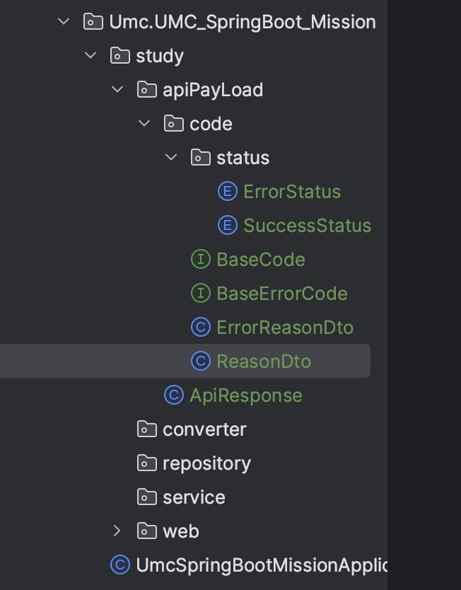
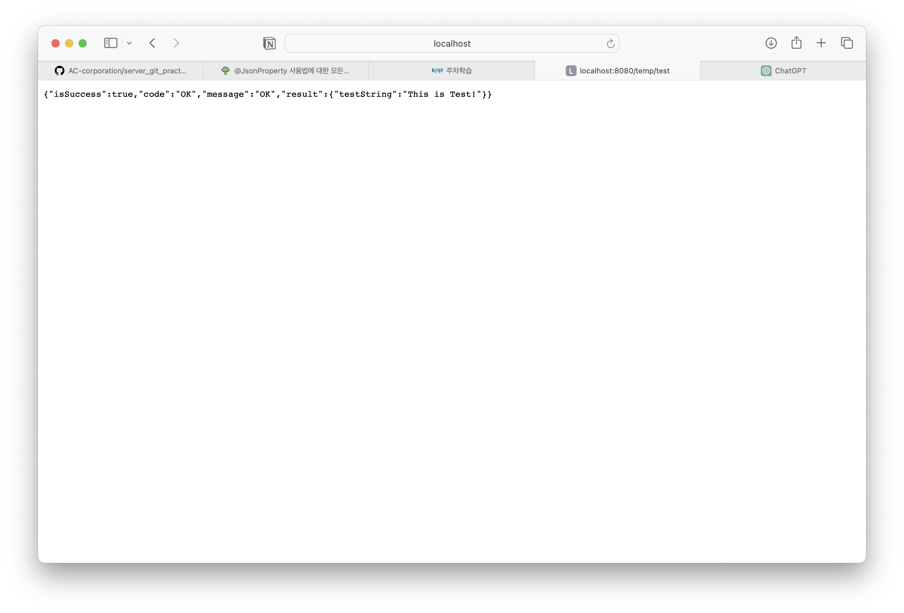

# UMC_SpringBoot_Study
<br>

# ✅ API 응답 통일
🔎 api 통합은 왜 필요할까요? <br>
서버와 클라이언트의 소통에 있어서 통일된 양식을 사용하지 않으면 헷갈리거나 신경써야 할 부분이 많이 생깁니다<br>
따라서 api 양식을 통일하는 것은 프로젝트 진행에 있어서 굉장히 중요합니다 <br>

아래는 api응답으로 많이 쓰이는 형태입니다 
```json
{
	isSuccess : Boolean
	code : String
	message : String
	result : {응답으로 필요한 또 다른 json}
}
```
- `isSuccess` : 응답 성공 유무
- `code `: HTTP 상태 코드 외에 더 세부적인 결과 제공
- `message` : 결과에 대해 추가적인 정보 제공
- `result` : 응답 제공/ 응답이 실패한 경우 `null`

<br><br>

## ✅ ApiPayLoad
우선 api 응답 통일을 위해 `ApiPayLoad` 라는 package를 만들어줬습니다 <br>
패키지 내부에 `ApiResponse` 클래스를 만들어, 이 내부에서 Api 관련 코드들을 작성해주었습니다 <br>

 <br><br>
- `BaseCode`, `BaseErrorCode` <br>
   status 관련 클래스들이 해당 인터페이스의 메소드를 오버라이드하도록 설계
    ```java
    public interface BaseCode {
        public ReasonDTO getReason();
        public ReasonDTO getReasonHttpStatus();
    }
    ```

    ```java
    public interface BaseErrorCode {
        public ErrorReasonDTO getReason();
        public ErrorReasonDTO getReasonHttpStatus();
    }
    ```
<br>

- `ReasonDTO`, `ErrorReasonDTO`
    ```java
    @Builder
    @Getter
    @NoArgsConstructor
    @AllArgsConstructor
    public class ReasonDTO {
        private Boolean isSuccess;
        private String code;
        private String message;
        private HttpStatus httpStatus;
    }
    ```

    ```java
    @Builder
    @Getter
    @NoArgsConstructor
    @AllArgsConstructor
    public class ErrorReasonDTO {
        private Boolean isSuccess;
        private String code;
        private String message;
        private HttpStatus httpStatus;
    }
    ``` 
    <br><br><br>

### BaseCode, Status
`code` package 내부에 상태에 대해 정의할 enum `ErrorStatus`, `SuccessStatus` 를 만들어주고 각각 `BaseErrorCode`, `BaseCode` interface를 implement해 코드를 구체화 해주었습니다 🙂<br><br>

```java
private final HttpStatus httpStatus;
private final String code;
private final String message;
```
두 enum에 위의 필드들을 추가해주고, 

- ErrorStatus
    ```java
    @Override
    public ErrorReasonDTO getReason() {
        return ErrorReasonDTO.builder()
                .code(code)
                .message(message)
                .isSuccess(false)
                .build();
    }

    @Override
    public ErrorReasonDTO getReasonHttpStatus() {
        return ErrorReasonDTO.builder()
                .code(code)
                .message(message)
                .isSuccess(false)
                .httpStatus(httpStatus)
                .build();
    }
    ```
    ErrorStatus에서는 BaseErrorCode의 메소드들을 build 패턴을 사용해 구체화했고, <br><br>

- SuccessStatus
  ```java
   @Override
    public ReasonDTO getReason() {
        return ReasonDTO.builder()
                .code(code)
                .message(message)
                .isSuccess(true)
                .build();
    }

    @Override
    public ReasonDTO getReasonHttpStatus() {
        return ReasonDTO.builder()
                .code(code)
                .message(message)
                .isSuccess(true)
                .httpStatus(httpStatus)
                .build();
    }
  ```
  SuccessStatus에서도 BaseCode interface의 메소드들을 같은 방식으로 구체화했습니다 🤩

<br><br>


### ApiResponse
위에서 작성한 코드들을 이용해 통일된 Api 응답을 위한 클래스를 작성해봅시다 ‼️ <br>
맨 처음 보았던 일반적인 response 형식을 위해 4가지의 필드들을 설정해줍니다
```java
@Getter
@AllArgsConstructor
@JsonPropertyOrder({"isSuccess", "code", "message", "result"})
public class ApiResponse<T> {

    @JsonProperty("isSuccess") //Json으로 변환
    private final Boolean isSuccess;
    private final String code; //세부적인 응답 상황
    private final String message;
    @JsonInclude(JsonInclude.Include.NON_NULL)
    private T result;
}
```
<br>

🔎 여기서 `@JsonPropertyOrder`란, 

/////
<br><br><br>


추가로 통신이 성공했을 시 실행할 함수와 실패 시 실행할 함수를 작성해줍니다 <br>
```java
  //성공시 응답
    public static <T>ApiResponse<T> onSuccess(T result){
        return new ApiResponse<>(true, SuccessStatus._OK.getCode() , SuccessStatus._OK.getMessage(), result);
    }

    public static <T> ApiResponse<T> of(BaseCode code, T result){
        return new ApiResponse<>(true, code.getReasonHttpStatus().getCode() , code.getReasonHttpStatus().getMessage(), result);
    }


    //실패시 응답
    public static <T>ApiResponse<T> onFailure(String code, String message, T result){
        return new ApiResponse<>(true, code, message, result);
    }
```

- 통신이 성공하면,
- 통신이 실패하면


### 💫 임시 API 만들기
위에서 작성한 코드들을 바탕으로 잘 돌아가는지 테스트를 위해 임시 api를 만들어보겠습니다 🤩


### 💫 API 작동 테스트

main에서 브랜치를 새로 파서 미션 코드를 작성했는데, <br>
이전 미션에서 추가했던 mysql 관련 파일들이 다른 브랜치에 있어서 <br>
db연결을 할 수 없다고 자꾸 실행 오류가 뜨더군요 ....🥲 <br>
`application.yml` 을 추가해 저번 주차에 만든 local mysql db와 연결해주고, 관련 의존성까지 넣었더니 api가 정상적으로 작동했습니다 <br>
`localhost:8080/temp/test` 주소에 작성한 string들이 작성된 것을 볼 수 있습니다 👍 <br>

 <br><br>


